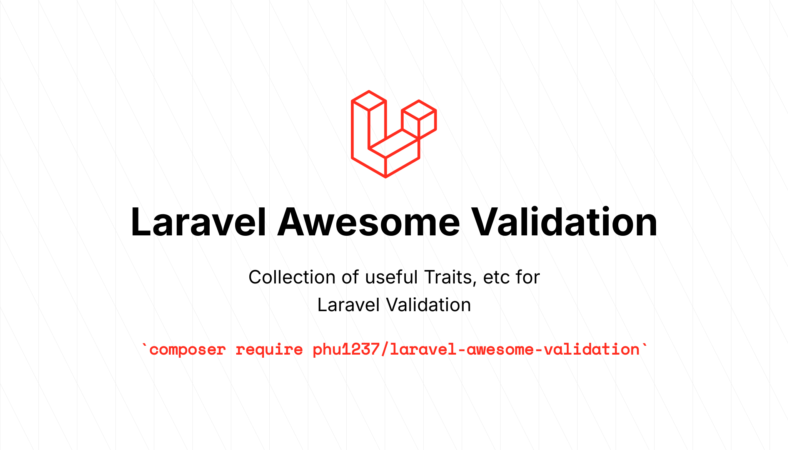

# Laravel Awesome Validation


[](https://packagist.org/packages/phu1237/laravel-awesome-validation)
[](https://github.com/Phu1237/laravel-awesome-validation/blob/master/LICENSE)

Collection of useful Traits, etc for Laravel Validation

## Content table

- [Installation](#installation)
- [Usage](#usage)
- [Command](#command)
- [License](#license)

## Installation

- Require this package with composer:

```bash
composer require phu1237/laravel-awesome-validation
```

### Laravel auto-discovery

Laravel uses Package Auto-Discovery, so doesn't require you to manually add the ServiceProvider.

### Laravel without auto-discovery

If you don't use auto-discovery, add the ServiceProvider to the providers array in config/app.php:

```php
Phu1237\AwesomeValidation\ServiceProvider::class,
```

- Done. You can use all functions now.

## Usage

## Command

Copy the package config to your local config with the publish command:

```bash
php artisan vendor:publish --provider="Phu1237\AwesomeValidation\ServiceProvider" --tag=config
```

## License

The Laravel Awesome Validation is open-sourced software licensed under
the [MIT license](http://opensource.org/licenses/MIT).
